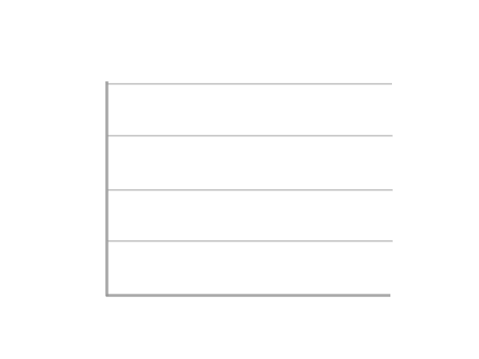

    

<!-- Header -->
<!-- 

   

 -->

<!-- Title -->
<!-- <h1 align="center"> Hi , I'm <a href="https://gausalmunirtushar.me">Pranab Dey</a> </h1>

<!-- Sub Title -->
<!-- <h2 align="center">Software Development Engineer</h2> -->

<h1></h1>
 

-    Ask me about Web Development
-   ❤️ I am passionate about Computer Science & I enjoy learning new things
-   💻 I enjoy programming & sharing knowledge
-   🌱 I’m currently exploring TypeScript
-   ⚡ **4+** years of experience

##     Connect with me!

<h1></h1>

##  Programming Languages

 
  
 

<table align="center">
   <tr align="left">
    <th> <b>🚶 Frontend Development </b></th> 
    <th> <b>🔙 Backend Development </b></th>
   </tr>
  <tr>
    <td>
     

 
      
      
      
     
     
      
      
     

  
    

   </td>
      <td>
          
 

 

      </td>
   </tr>
   <tr align="left">
        <th><b>👨‍💻Development Tools</b></th>
        <th> <b>📱Databases & Cloud Hosting </b></th>
   </tr>
  <tr>
    <td>
            
 
             
                  
            
           
                

         

    </td>
    <td>
          

            
        

    </td>
 </tr> 
 </table>

 ##  Github Stats </img>

